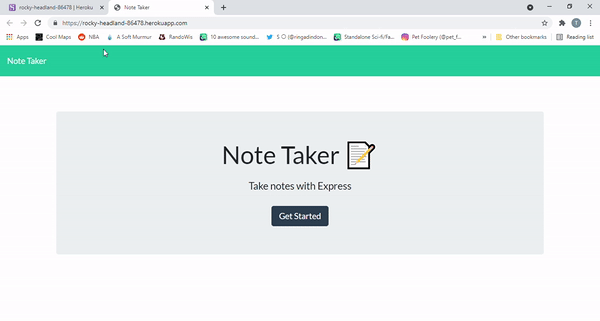

# NoteTaker
App that allows you to take notes utilizing Node and Express.js.

https://github.com/PratikPatel-Code/NoteTaker

https://rocky-headland-86478.herokuapp.com/

#

## Table of Contents

- [Project Overview](#Overview)

- [Project Goals](#Goals)

- [Running App](#Running)

- [Testing App](#Testing)

- [Contributers](#Contributers)

- [Technologies](#Technologies)

- [Links](#Links)

#
## Overview:
The project is designed to be an online note taking app.  When you get to the notes page, you will see previous notes on the left.  To the right you will have the ability to add new notes.  You should also be capable of deleting any notes.

#
## Goals:
1. Secure backend routes using the server.js file
2. Make sure all posts from users are entered into the database.
3. All previous notes should automatically appear using the get.

#
## Running:
- node.js must be installed
- Download the package.json
- run npm i
- express, uniqid, and uuid will install

#
## Testing:
- node server.js - to verify port connection

# 

📸

#

## Contributers:
[Pratik Patel](https://github.com/PratikPatel-Code/)

#
## Technologies:
[Visual Studio](https://visualstudio.microsoft.com/)

[CSS](https://www.w3.org/TR/CSS/#css)

[JavaScript](https://www.javascript.com/)

[Node](https://nodejs.org/en/)

[Express](https://expressjs.com/)

[Heroku](http://heroku.com/)

#
## Links: 
🔗[Email](pratikpatel_85@yahoo.com)

🔗[Github Profile](https://github.com/PratikPatel-Code/)

🔗[Deployed App](https://rocky-headland-86478.herokuapp.com/)

🔗[Project Repo](https://github.com/PratikPatel-Code/NoteTaker)

